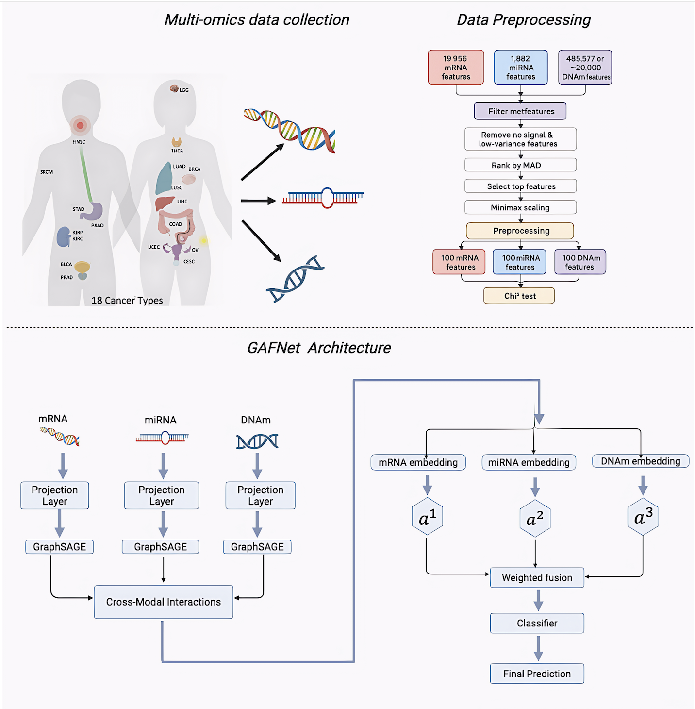
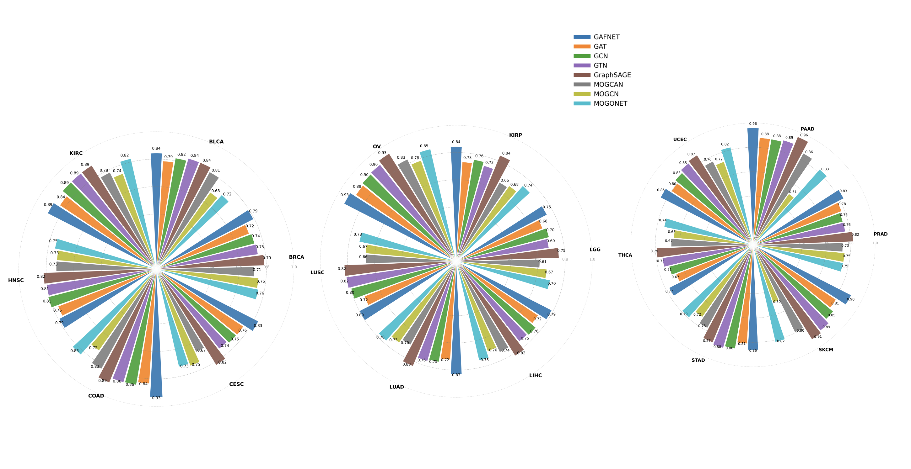

<!-- #region -->
# GraphSAGE with Attention Fusion for Interpretable Multi-Omics Biomarker Discovery




## Abstract
Multi-omics data provide comprehensive and complementary signals that are highly valuable for understanding disease mechanisms and predicting patient outcomes, particularly in cancer, which remains a leading cause of mortality worldwide. Traditional graph-based models rely on static neighborhood aggregation or layer-specific transformations, often limiting their ability to generalize across heterogeneous biomedical data. In contrast, Graph Sample and Aggregate (GraphSAGE) introduces an inductive learning framework that samples and aggregates information from neighboring nodes, enabling efficient learning on large or unseen graphs. To harness these rich yet heterogeneous data sources, we developed a GraphSAGE-based deep learning framework with an attention mechanism to classify cancer patients as short-term or long-term survivors, incorporating mRNA, miRNA, and DNA methylation profiles. The proposed model learns modality-specific embeddings from each omics layer using, effectively capturing local patient similarity patterns within each molecular domain, which are subsequently integrated through an attention mechanism to derive a unified multimodal representation. 
Across 18 TCGA cancer cohorts, the proposed model consistently achieved higher AUC values than existing graph-based methods (average AUC = 0.88, an improvement of 5–10% over baseline methods). Model performance was further enhanced by comparing multiple edge-creation strategies, with correlation-based edges yielding the most robust results. The framework was validated using stratified 5-fold cross-validation to ensure reliability and generalizability across datasets.
Finally, we applied the SHAP (SHapley Additive exPlanations) GradientExplainer to quantify the contribution of each molecular feature within mRNA, miRNA, and DNA methylation data, enabling the identification of biologically meaningful biomarkers associated with patient survival. Collectively, these results demonstrate that our GraphSAGE-Attention framework effectively integrates heterogeneous omics data, enhances graph connectivity, and improves predictive accuracy across diverse cancer types.


---

## Overview

```
mRNA ──► SAGEConv ──┐
miRNA ──► SAGEConv ──┼──► Inter-modal SAGEConv ──► Attention Fusion ──► Classifier
DNA ───► SAGEConv ──┘
```

- **Graph construction**: Symmetric mutual-kNN graphs per modality + bidirectional cross-modality edges
- **Message passing**: Per-modality `SAGEConv` → two inter-modality `SAGEConv` layers
- **Fusion**: Softmax attention over the three modality embeddings
- **Training**: Stratified k-fold CV with early stopping, AdamW optimiser, BCELoss
- **Evaluation**: AUC-ROC, Accuracy, F1 (macro)

---

## Project Structure

```
pancancers/
├── graph_utils.py     # kNN graph construction & edge index utilities
├── model.py           # MultimodalGraphSAGE_AttentionFusion (nn.Module)
├── train.py           # Training loop, evaluation, cross-validation, grid search
├── hyperparams.py     # Parameter grids & grid builder helpers
└── main.py            # CLI entry point & per-dataset loop
```

---

## Installation

```bash

# 1. Install dependencies
pip install torch torchvision torchaudio --index-url https://download.pytorch.org/whl/cu118
pip install torch-geometric
pip install scikit-learn pandas matplotlib seaborn
```

> **PyTorch Geometric** may require extra wheels depending on your CUDA version.  
> See the [official install guide](https://pytorch-geometric.readthedocs.io/en/latest/install/installation.html).

---

## Data Format

Each dataset lives under `{data_path}/{dataset}/minimax_var_1/` and contains four CSV files:

| File | Description | Shape |
|---|---|---|
| `rna.csv` | mRNA expression (pre-normalised) | `(n_samples, n_genes)` |
| `mirna.csv` | miRNA expression (pre-normalised) | `(n_samples, n_mirnas)` |
| `dna.csv` | DNA methylation beta values | `(n_samples, n_cpg)` |
| `clinical.csv` | Labels — must contain a `median_value` column | `(n_samples, ...)` |

The `median_value` column should be binary (0 / 1).

---

## Usage

### Run with defaults

```bash
python main.py
```

### Run with custom arguments

```bash
python main.py \
  --device auto \
  --data_path /path/to/data/ \
  --kfolds 5 \
  --k_neighbors 40
```

### All CLI flags

| Flag | Default | Description |
|---|---|---|
| `--device` | `cuda` | Compute device: `auto`, `cuda`, `cpu`, `mps` |
| `--amp` | off | Enable mixed-precision training (CUDA only) |
| `--data_path` | *(set in script)* | Root directory containing dataset subfolders |
| `--dna_file` | `dna.csv` | DNA methylation CSV filename |
| `--mirna_file` | `mirna.csv` | miRNA expression CSV filename |
| `--mrna_file` | `rna.csv` | mRNA expression CSV filename |
| `--clinical_file` | `clinical.csv` | Clinical labels CSV filename |
| `--k_neighbors` | `40` (grid) | kNN neighbours — overrides grid search when set |
| `--kfolds` | `5` | Number of stratified CV folds |
| `--top_k` | `100` | Top-K features for chi² selection (if re-enabled) |

---

## Hyperparameter Grid

Defined in `hyperparams.py`. The default search space is:

```python
grid_common = {
    "hidden_channels": [64, 128],
    "dropout":         [0.1, 0.3, 0.4],
    "lr":              [1e-3, 2e-4, 3e-4],
    "weight_decay":    [5e-4],
    "num_epochs":      [200],
    "patience":        [20],
    "eval_every":      [15],
    "kfolds":          [5],
}

grid_knn_only = {
    "k_neighbors": [40],
}
```

## Outputs

For each dataset, three files are written to the output directory:

| File | Content |
|---|---|
| `{dataset}_atten_map.npy` | Attention weights array — shape `(n_val_samples, 3)` |
| `{dataset}_attn_dist.png` | Violin plot of per-modality attention distributions |
| `{dataset}_result.csv` | Best hyperparams + mean/std AUC, F1, ACC across folds |

---

## Supported Datasets

18 TCGA cancer types are processed by default:

`STAD` · `LUSC` · `PRAD` · `LIHC` · `KIRP` · `LUAD` · `KIRC` · `BRCA` · `UCEC` · `LGG` · `HNSC` · `PAAD` · `SKCM` · `OV` · `THCA` · `CESC` · `BLCA` · `COAD`
To obtain the preprocessed dataset, please contact Sevinj Yolchuyeva.

## To run a subset, edit the `DATASETS` list in `model/main.py`.


## Results




## Citation


## Authors

**Sevinj Yolchuyeva**
Email: [sevinj.yolchuyeva@crchudequebec.ulaval.ca](mailto:sevinj.yolchuyeva@crchudequebec.ulaval.ca)

Centre de Recherche du CHU de Québec - Université Laval


